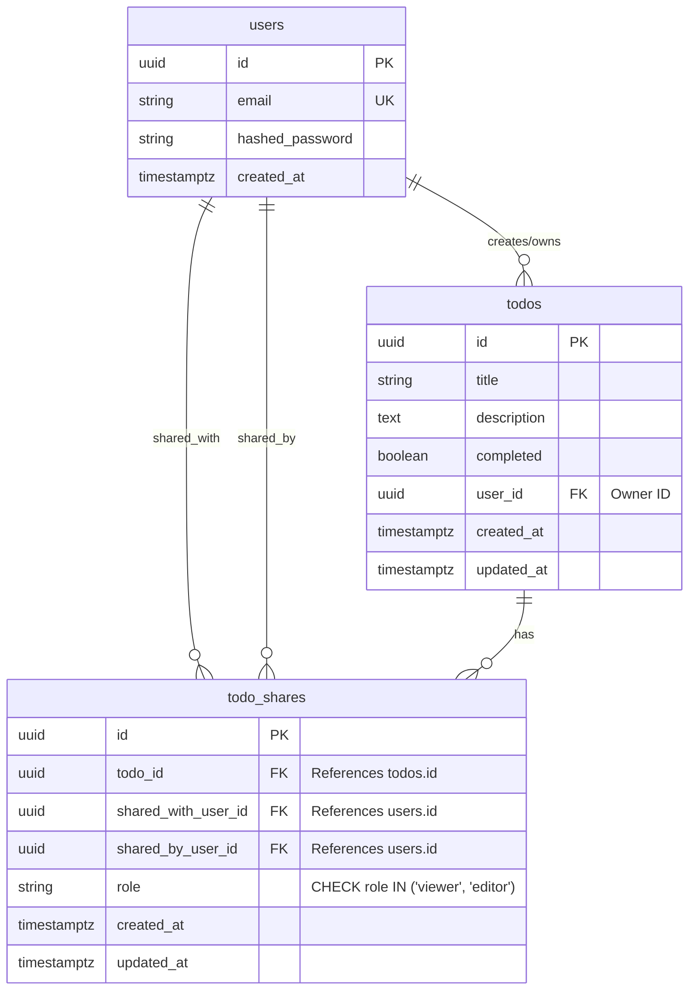

# Technical Specification: Todo Sharing & Collaboration Feature

> **Document Version**: 1.0.0  
> **Status**: Ready for Review / Production-Grade  
> **Target Release**: Sprint Release — Collaboration Scope  
> **Author**: Full-Stack Engineering Assessment Team  

---

## 1. Overview & Objective (Tổng quan & Mục tiêu)

### 1.1. Feature Summary
Tính năng **Todo Sharing & Collaboration** cho phép người dùng (Owner) chia sẻ danh sách hoặc các đầu việc Todo cụ thể của mình cho các người dùng khác trong hệ thống. Quyền truy cập được phân chia rõ ràng thành hai cấp độ:
- **`VIEWER` (Chỉ đọc)**: Xem danh sách và chi tiết các công việc được chia sẻ.
- **`EDITOR` (Chỉnh sửa)**: Xem và cập nhật trạng thái (`completed`), tiêu đề (`title`), và mô tả (`description`) của Todo.

Chủ sở hữu (Owner) nắm toàn quyền quản lý, bao gồm phân quyền, thay đổi vai trò và thu hồi (revoke) quyền truy cập bất cứ lúc nào với hiệu lực tức thì.

### 1.2. Problem Statement
Hiện tại, ứng dụng Todo chỉ hỗ trợ người dùng quản lý công việc mang tính cá nhân đơn lẻ. Người dùng không có phương tiện để cộng tác, phân chia công việc hoặc theo dõi tiến độ công việc chung với đồng nghiệp, đối tác hoặc người thân. Việc chia sẻ giúp tăng tính tương tác, cải thiện hiệu suất làm việc nhóm và mở rộng giá trị sử dụng của sản phẩm.

### 1.3. Target Audience & Personas
- **Owner (Chủ sở hữu)**: Người tạo ra công việc, có toàn quyền sở hữu, quản lý chia sẻ và quyết định ai được xem/sửa công việc của mình.
- **Editor (Cộng tác viên biên tập)**: Người được phân quyền để cùng tham gia giải quyết công việc, cập nhật tiến độ, sửa đổi chi tiết công việc mà không thể xóa bỏ hoặc chuyển quyền sở hữu của công việc.
- **Viewer (Người theo dõi)**: Người cần nắm bắt thông tin hoặc tiến độ công việc mà không được phép can thiệp làm thay đổi dữ liệu.

---

## 2. User Stories & Acceptance Criteria (Yêu cầu nghiệp vụ)

### User Story 1: Chia sẻ Todo cho người dùng khác
- **As an** Owner,
- **I want to** chia sẻ Todo của mình cho người dùng khác qua email với vai trò `viewer` hoặc `editor`,
- **So that** họ có thể xem hoặc cùng tôi hoàn thành công việc.
- **Acceptance Criteria**:
  - [ ] Owner có thể nhập email của người nhận và lựa chọn vai trò (`viewer` hoặc `editor`).
  - [ ] Hệ thống kiểm tra tính hợp lệ của email và xác nhận người dùng nhận chia sẻ đã tồn tại trong hệ thống (trả về `404 Not Found` nếu không tìm thấy user).
  - [ ] Hệ thống chặn trường hợp Owner tự chia sẻ công việc cho chính mình (trả về `400 Bad Request`).
  - [ ] Hệ thống ngăn chặn việc mời trùng lặp cùng một user vào một Todo (trả về `409 Conflict`).
  - [ ] Chỉ có Owner mới có quyền tạo chia sẻ (người khác cố tình gọi API nhận `403 Forbidden`).

### User Story 2: Xem danh sách Todo được chia sẻ ("Shared With Me")
- **As a** Collaborator (Viewer / Editor),
- **I want to** xem danh sách các Todo mà người khác đã chia sẻ cho tôi trong một mục riêng biệt,
- **So that** tôi dễ dàng theo dõi và không bị lẫn lộn với các Todo cá nhân do tôi tạo ra.
- **Acceptance Criteria**:
  - [ ] Endpoint riêng `GET /api/v1/todos/shared-with-me` trả về danh sách phân trang các Todo được chia sẻ.
  - [ ] Dữ liệu trả về hiển thị rõ: Thông tin Todo, Email của Owner, vai trò của người dùng hiện tại (`my_role: "viewer" | "editor"`), và thời điểm được chia sẻ.
  - [ ] Danh sách được sắp xếp theo thứ tự mới nhất (`created_at DESC`).

### User Story 3: Cập nhật Todo được chia sẻ (Dành cho Editor)
- **As an** Editor,
- **I want to** cập nhật tiêu đề, mô tả hoặc đánh dấu hoàn thành Todo được chia sẻ,
- **So that** tôi có thể cập nhật tiến độ công việc chung.
- **Acceptance Criteria**:
  - [ ] Editor có thể gọi `PUT /api/v1/todos/{todo_id}` để thay đổi `title`, `description`, hoặc `completed`.
  - [ ] Viewer khi cố tình gọi `PUT /api/v1/todos/{todo_id}` sẽ bị từ chối với mã lỗi `403 Forbidden`.
  - [ ] Editor cố tình gọi `DELETE /api/v1/todos/{todo_id}` sẽ bị từ chối với mã lỗi `403 Forbidden` (chỉ Owner mới có quyền xóa).
  - [ ] Mọi thay đổi của Editor được phản ánh ngay cho Owner và các collaborator khác khi tải lại dữ liệu.

### User Story 4: Thay đổi quyền hoặc Thu hồi quyền truy cập
- **As an** Owner,
- **I want to** đổi quyền của collaborator (từ Viewer sang Editor và ngược lại) hoặc thu hồi quyền truy cập bất kỳ lúc nào,
- **So that** tôi duy trì quyền kiểm soát dữ liệu của mình.
- **Acceptance Criteria**:
  - [ ] Owner có thể gọi `PATCH /api/v1/todos/{todo_id}/shares/{share_id}` để cập nhật vai trò.
  - [ ] Owner có thể gọi `DELETE /api/v1/todos/{todo_id}/shares/{share_id}` để hủy chia sẻ.
  - [ ] Ngay sau khi quyền bị thu hồi, collaborator bị chặn lập tức khỏi Todo đó (mọi request tiếp theo trả về `403 Forbidden`).
  - [ ] Cache Redis của collaborator liên quan bị xóa ngay lập tức (Immediate Cache Invalidation).

---

## 3. Scope (Phạm vi Dự án)

### 3.1. In-Scope (Bắt buộc trong phiên bản này)
1. Bảng cơ sở dữ liệu `todo_shares` quản lý mối quan hệ chia sẻ giữa Todo và người dùng.
2. Hai cấp độ phân quyền cố định: `viewer` (chỉ đọc) và `editor` (đọc & sửa).
3. API đầy đủ cho vòng đời chia sẻ: Tạo chia sẻ, Liệt kê danh sách chia sẻ của Todo, Sửa quyền, Thu hồi quyền, Lấy danh sách Todo được chia sẻ.
4. Cơ chế kiểm soát quyền (Authorization Guard) nghiêm ngặt tại middleware/dependency backend.
5. Invalidate cache Redis đồng bộ ngay khi phát sinh thay đổi dữ liệu hoặc quyền.
6. Xử lý triệt để các trường hợp biên (Self-sharing, Duplicate share, Race condition khi revoke).

### 3.2. Out-of-Scope (Dành cho các phiên bản tiếp theo)
1. **Email Notifications / Webhook**: Gửi email thông báo khi được mời hoặc khi có thay đổi công việc.
2. **Public Link Sharing**: Tạo đường dẫn công khai (token-based) cho người chưa có tài khoản.
3. **Custom Roles / Granular Permissions**: Quyền tùy biến (ví dụ: chỉ được toggle completed mà không được sửa text).
4. **Activity Logs & Audit Trail**: Nhật ký lịch sử ai đã sửa nội dung gì vào thời điểm nào.
5. **Ownership Transfer**: Tính năng chuyển giao quyền sở hữu Todo sang cho người khác.
6. **Re-sharing by Collaborators**: Người được chia sẻ không được phép chia sẻ tiếp cho bên thứ ba.

---

## 4. Database Design (Thiết kế Cơ sở Dữ liệu)

### 4.1. Entity Relationship Diagram (ERD)



### 4.2. Schema Chi tiết Bảng `todo_shares`

```sql
CREATE TYPE share_role AS ENUM ('viewer', 'editor');

CREATE TABLE todo_shares (
    id UUID PRIMARY KEY DEFAULT gen_random_uuid(),
    todo_id UUID NOT NULL,
    shared_with_user_id UUID NOT NULL,
    shared_by_user_id UUID NOT NULL,
    role VARCHAR(20) NOT NULL,
    created_at TIMESTAMPTZ NOT NULL DEFAULT NOW(),
    updated_at TIMESTAMPTZ NOT NULL DEFAULT NOW(),

    -- Ràng buộc khóa ngoại với Cascade Delete
    CONSTRAINT fk_todo_shares_todo
        FOREIGN KEY (todo_id) REFERENCES todos(id) ON DELETE CASCADE,
    CONSTRAINT fk_todo_shares_shared_with
        FOREIGN KEY (shared_with_user_id) REFERENCES users(id) ON DELETE CASCADE,
    CONSTRAINT fk_todo_shares_shared_by
        FOREIGN KEY (shared_by_user_id) REFERENCES users(id) ON DELETE CASCADE,

    -- Ràng buộc toàn vẹn dữ liệu
    CONSTRAINT uq_todo_share_target
        UNIQUE (todo_id, shared_with_user_id),
    CONSTRAINT chk_valid_role
        CHECK (role IN ('viewer', 'editor')),
    CONSTRAINT chk_no_self_share
        CHECK (shared_with_user_id <> shared_by_user_id)
);
```

### 4.3. Indexes & Tối ưu hiệu năng Truy vấn
1. `idx_todo_shares_shared_with`:
   - `CREATE INDEX idx_todo_shares_shared_with ON todo_shares(shared_with_user_id);`
   - *Mục đích*: Tối ưu hóa truy vấn màn hình `Shared With Me` của collaborator.
2. `idx_todo_shares_todo_lookup`:
   - `CREATE INDEX idx_todo_shares_todo_lookup ON todo_shares(todo_id, shared_with_user_id);`
   - *Mục đích*: Cho phép kiểm tra quyền truy cập (Permission Check) của một user trên một Todo cụ thể với độ phức tạp `O(1)`.
3. `idx_todo_shares_owner`:
   - `CREATE INDEX idx_todo_shares_owner ON todo_shares(shared_by_user_id);`
   - *Mục đích*: Tối ưu việc truy vấn quản lý chia sẻ từ phía Owner.

---

## 5. API Contracts & Endpoints (Đặc tả Giao diện Lập trình API)

Base Prefix: `/api/v1`

| Method | Endpoint | Description | Roles cho phép | Auth Required |
| :--- | :--- | :--- | :--- | :--- |
| **POST** | `/api/v1/todos/{todo_id}/shares` | Tạo chia sẻ Todo cho user khác | Owner | Yes |
| **GET** | `/api/v1/todos/{todo_id}/shares` | Xem danh sách cộng tác viên của Todo | Owner | Yes |
| **PATCH** | `/api/v1/todos/{todo_id}/shares/{share_id}` | Cập nhật vai trò (`viewer` / `editor`) | Owner | Yes |
| **DELETE** | `/api/v1/todos/{todo_id}/shares/{share_id}` | Thu hồi quyền chia sẻ | Owner | Yes |
| **GET** | `/api/v1/todos/shared-with-me` | Lấy danh sách Todo được chia sẻ với mình | Any User | Yes |
| **GET** | `/api/v1/todos/{todo_id}` | Lấy chi tiết Todo | Owner, Editor, Viewer | Yes |
| **PUT** | `/api/v1/todos/{todo_id}` | Cập nhật Todo | Owner, Editor | Yes |
| **DELETE** | `/api/v1/todos/{todo_id}` | Xóa Todo | Owner Only | Yes |

---

### 5.1. Chi tiết Request & Response Schemas (Pydantic / JSON)

#### 1. POST `/api/v1/todos/{todo_id}/shares`
- **Request Body**:
```json
{
  "email": "collaborator@test.com",
  "role": "editor"
}
```
- **Validation Rules**:
  - `email`: `EmailStr`, bắt buộc.
  - `role`: Enum `["viewer", "editor"]`, bắt buộc.
- **Responses**:
  - `201 Created`:
    ```json
    {
      "id": "c1f7a635-a7b3-4f91-a1e6-b63e18ad4022",
      "todo_id": "b3e34b12-5813-41a4-9279-509e51c86321",
      "shared_with_user_id": "7b7a1234-9812-4f12-8888-111122223333",
      "shared_with_email": "collaborator@test.com",
      "role": "editor",
      "created_at": "2026-09-22T14:30:00Z",
      "updated_at": "2026-09-22T14:30:00Z"
    }
    ```
  - `400 Bad Request`: `{"detail": "Cannot share todo with yourself"}`
  - `403 Forbidden`: `{"detail": "Only the owner can share this todo"}`
  - `404 Not Found`: `{"detail": "User with this email not found"}` hoặc `{"detail": "Todo not found"}`
  - `409 Conflict`: `{"detail": "Todo is already shared with this user"}`

#### 2. PATCH `/api/v1/todos/{todo_id}/shares/{share_id}`
- **Request Body**:
```json
{
  "role": "viewer"
}
```
- **Responses**:
  - `200 OK`: Trả về Share Object sau khi cập nhật.
  - `400 Bad Request`: `{"detail": "Invalid role specified"}`
  - `403 Forbidden`: `{"detail": "Only the owner can modify share permissions"}`
  - `404 Not Found`: `{"detail": "Share record not found"}`

#### 3. DELETE `/api/v1/todos/{todo_id}/shares/{share_id}`
- **Responses**:
  - `204 No Content`: Thu hồi quyền thành công.
  - `403 Forbidden`: `{"detail": "Only the owner can revoke share access"}`
  - `404 Not Found`: `{"detail": "Share record not found"}`

#### 4. GET `/api/v1/todos/shared-with-me?page=1&size=20`
- **Query Params**:
  - `page`: integer >= 1 (default: 1)
  - `size`: integer >= 1, <= 100 (default: 20)
- **Responses**:
  - `200 OK`:
    ```json
    {
      "items": [
        {
          "id": "b3e34b12-5813-41a4-9279-509e51c86321",
          "title": "Team Sprint Planning",
          "description": "Prepare agenda for Q4",
          "completed": false,
          "owner_email": "owner@test.com",
          "my_role": "editor",
          "shared_at": "2026-09-22T14:30:00Z",
          "created_at": "2026-09-20T10:00:00Z",
          "updated_at": "2026-09-22T14:30:00Z"
        }
      ],
      "total": 1,
      "page": 1,
      "size": 20
    }
    ```

---

## 6. Business Logic & Security Considerations (Quy tắc Nghiệp vụ & Bảo mật)

### 6.1. Authorization Matrix (Ma trận Phân quyền Chi tiết)

| Thao tác nghiệp vụ | Owner | Editor | Viewer | Người dùng khác |
| :--- | :---: | :---: | :---: | :---: |
| **Xem chi tiết Todo (`GET /todos/{id}`)** | Cho phép | Cho phép | Cho phép | Bị chặn (`403`) |
| **Sửa Title / Description (`PUT /todos/{id}`)** | Cho phép | Cho phép | Bị chặn (`403`) | Bị chặn (`403`) |
| **Bật/Tắt hoàn thành (`completed`)** | Cho phép | Cho phép | Bị chặn (`403`) | Bị chặn (`403`) |
| **Xóa Todo (`DELETE /todos/{id}`)** | Cho phép | Bị chặn (`403`) | Bị chặn (`403`) | Bị chặn (`403`) |
| **Tạo lời mời chia sẻ mới** | Cho phép | Bị chặn (`403`) | Bị chặn (`403`) | Bị chặn (`403`) |
| **Thay đổi vai trò Collaborator** | Cho phép | Bị chặn (`403`) | Bị chặn (`403`) | Bị chặn (`403`) |
| **Thu hồi quyền chia sẻ (Revoke)** | Cho phép | Bị chặn (`403`) | Bị chặn (`403`) | Bị chặn (`403`) |

### 6.2. Edge Cases & Xử lý Xung đột Đồng thời (Race Conditions)

1. **Chặn Self-Sharing (Tự chia sẻ cho bản thân)**:
   - Được bảo vệ ở 3 tầng: Pydantic Validator -> Service check (`shared_with.id == current_user.id`) -> Database CHECK constraint (`shared_with_user_id <> shared_by_user_id`).
2. **Mời trùng lặp (Duplicate Share)**:
   - Sử dụng Unique Constraint `uq_todo_share_target(todo_id, shared_with_user_id)` và truy vấn kiểm tra trước khi tạo. Nếu trùng trả về `409 Conflict`.
3. **Thu hồi quyền trong khi Collaborator đang gửi request sửa (Concurrent Update vs Revoke)**:
   - Trong quá trình xử lý `PUT /todos/{todo_id}`, hệ thống thực hiện kiểm tra quyền bên trong cùng một Database Transaction. Nếu bản ghi `todo_shares` vừa bị Owner xóa, truy vấn kiểm tra quyền trả về `None` -> Ném ngay `403 Forbidden` và rollback cập nhật.
4. **Owner xóa Todo khi có người đang cộng tác**:
   - Khóa ngoại thiết lập `ON DELETE CASCADE` tự động dọn sạch mọi bản ghi liên quan trong bảng `todo_shares`.
5. **Chống lạm quyền chia sẻ tiếp (Anti Re-sharing)**:
   - Collaborators (kể cả Editor) tuyệt đối không có quyền chia sẻ Todo cho bất kỳ ai. Mọi lời gọi API chia sẻ đều kiểm tra `todo.user_id == current_user.id`.

---

## 7. Caching & Invalidation Strategy (Chiến lược Caching Redis)

Nhằm đảm bảo hiệu năng cao và bảo mật dữ liệu tuyệt đối không bị rò rỉ qua cache, cấu trúc key và chính sách dọn dẹp cache được thiết kế như sau:

### 7.1. Cấu trúc Cache Key (Redis Key Patterns)
- **Danh sách Todo cá nhân của user**:  
  `todos:personal:{user_id}:page:{page}:size:{size}`
- **Danh sách Todo được chia sẻ với user**:  
  `todos:shared:{user_id}:page:{page}:size:{size}`
- **Chi tiết Todo theo ID**:  
  `todos:detail:{todo_id}`
- **Cache quyền hạn người dùng trên Todo (Permission Cache)**:  
  `todos:perm:{user_id}:{todo_id}`  
  *Value*: `"owner"` | `"editor"` | `"viewer"` (TTL: 60 giây).

### 7.2. Ma trận Invalidate Cache khi có Sự kiện (Invalidation Triggers)

| Sự kiện (Event Trigger) | Các Key Redis cần bị Invalidate ngay lập tức |
| :--- | :--- |
| **Owner cập nhật Todo** | 1. `todos:personal:{owner_id}:*`<br>2. `todos:detail:{todo_id}`<br>3. `todos:shared:{collaborator_id}:*` (của tất cả collaborators) |
| **Editor cập nhật Todo** | 1. `todos:personal:{owner_id}:*`<br>2. `todos:detail:{todo_id}`<br>3. `todos:shared:{collaborator_id}:*` (của tất cả collaborators) |
| **Owner xóa Todo** | 1. `todos:personal:{owner_id}:*`<br>2. `todos:detail:{todo_id}`<br>3. `todos:shared:{collaborator_id}:*` (của tất cả collaborators)<br>4. `todos:perm:*:{todo_id}` |
| **Owner tạo/đổi quyền Share** | 1. `todos:shared:{collaborator_id}:*`<br>2. `todos:perm:{collaborator_id}:{todo_id}` |
| **Owner thu hồi quyền (Revoke)** | 1. `todos:shared:{collaborator_id}:*`<br>2. `todos:perm:{collaborator_id}:{todo_id}` *(collaborator mất quyền ngay lập tức)* |

---

## 8. Rollout Plan & Testing Strategy (Kế hoạch Triển khai)

1. **Database Migration**: Tạo migration Alembic `003_add_todo_shares_table.py` với đầy đủ indexes và constraints.
2. **Backend Services & Permissions**:
   - Xây dựng `ShareService` xử lý nghiệp vụ chia sẻ.
   - Thêm dependency `require_todo_access(min_role="viewer" | "editor" | "owner")` kiểm tra quyền tập trung.
3. **Automated Testing Suite**:
   - Unit tests cho logic kiểm tra quyền trong Service.
   - Integration tests: Mời trùng (409), Tự mời (400), Viewer cố tình sửa (403), Editor sửa thành công (200), Thu hồi quyền làm mất quyền tức thì (403), Invalidate Redis cache.
